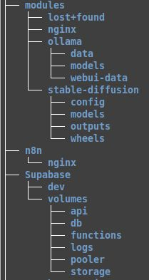
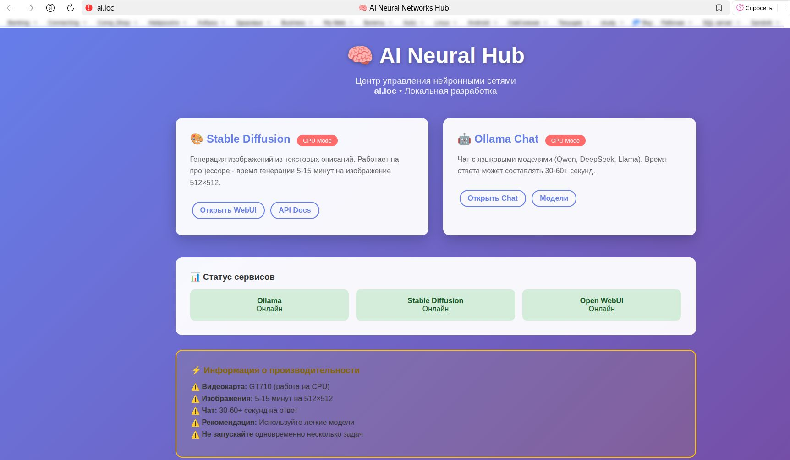
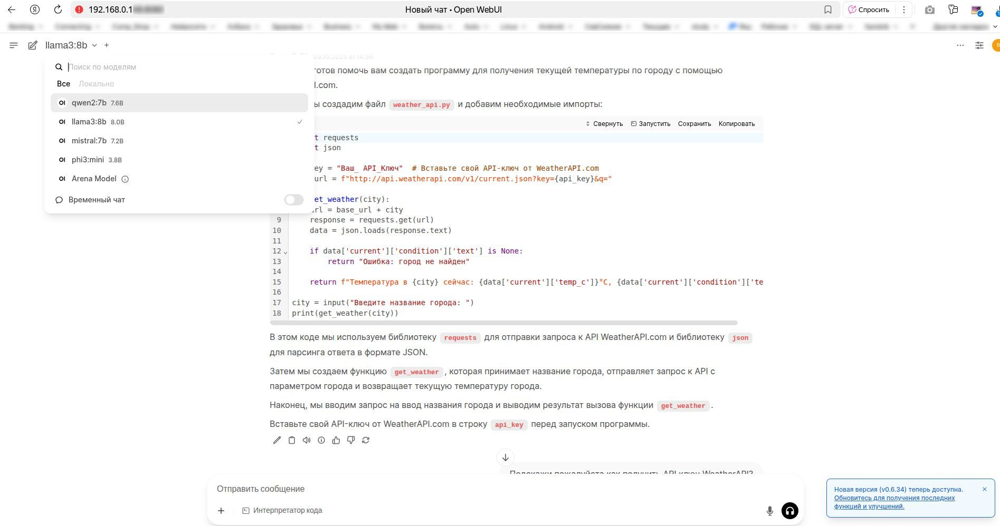
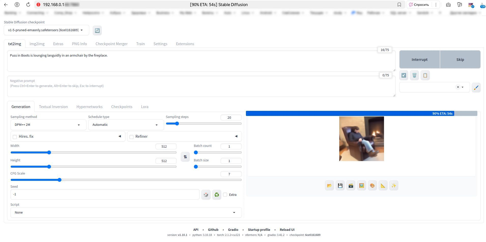
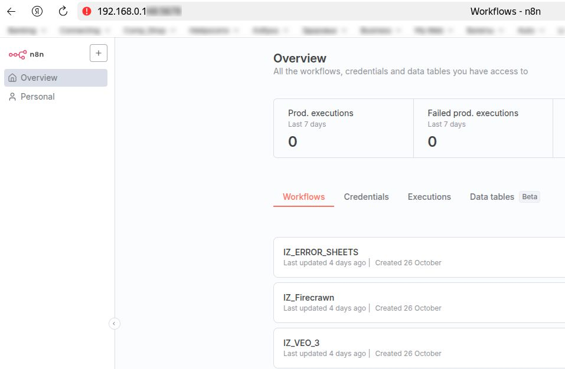
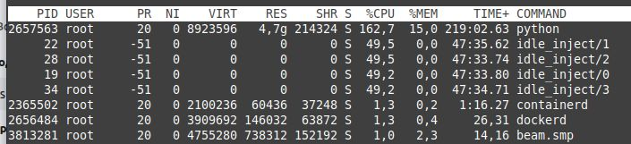

## 🖼️ Визуализация проекта: интерфейсы и архитектура

В этом разделе представлены скриншоты ключевых компонентов развернутой системы. Каждое изображение демонстрирует работающий функционал и архитектуру локального AI-сервера

---

[⬅️ Вернуться к описанию проекта](../README.md)

---

## 📁 Структура проекта

**directory** — организация файловой структуры на локальном сервере. Показаны каталоги для каждого Docker-контейнера с настройками, данными и моделями. Такая структура обеспечивает изоляцию сервисов и упрощает управление версиями.

## 🤖 Интерфейс выбора нейросетей

**ai.loc** — главная страница для выбора типа нейросети. Централизованный интерфейс позволяет быстро переключаться между LLM и StableDiffusion в зависимости от задачи.

## 💬 Работа с языковыми моделями

**OpenWebUI** — интерфейс Open WebUI для выбора конкретной языковой модели на локальном сервере. Здесь можно переключаться между различными LLM, тестировать их ответы и настраивать параметры генерации.

## 🎨 Генерация изображений

**StableDiffusion** — реальный пример генерации изображения через AUTOMATIC1111 WebUI. Скриншот демонстрирует настройки промпта, параметры генерации и результат работы модели с использованием локального CPU.

## ⚙️ Автоматизация с n8n

**n8n** — рабочее пространство n8n на локальном сервере. Показаны созданные автоматизированные процессы (workflows) для интеграции различных сервисов и API. n8n позволяет визуально создавать цепочки обработки данных между LLM, базами данных и внешними системами.

## 🗄️ Управление базой данных

**Supabase** — административная панель Supabase для управления базой данных. Интерфейс позволяет создавать таблицы, настраивать связи и управлять данными без необходимости писать SQL-запросы вручную.

## 📈 Мониторинг производительности

**Загрузка сервера** — системный мониторинг загрузки сервера во время активной генерации изображений в StableDiffusion. Скриншот демонстрирует реальное потребление ресурсов (CPU, RAM) и подтверждает работоспособность системы под нагрузкой.

---

Эти визуальные материалы подтверждают практический опыт развертывания и настройки полноценного AI-стека в локальной среде. Проект демонстрирует навыки работы с Docker, AI-инструментами и создания интегрированных решений для автоматизации.

---

[⬅️ Вернуться к описанию проекта](../README.md)
